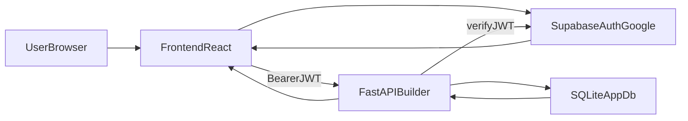

# Account-Based Builder + Credits V1 Plan

## Goal

Move from anonymous session-based generation to authenticated user accounts, so each chat session and generated website is owned by a user, with DB-backed tier/credit limits for generation usage.

## Current Baseline (confirmed)

- Chat identity is anonymous local storage `session_id` in `[/Users/marcuschien/code/MC134fd/ceoclaw/frontend/src/hooks/useSession.ts](/Users/marcuschien/code/MC134fd/ceoclaw/frontend/src/hooks/useSession.ts)`.
- Backend ownership is session-only (`chat_sessions.session_id`), no user FK in `[/Users/marcuschien/code/MC134fd/ceoclaw/data/database.py](/Users/marcuschien/code/MC134fd/ceoclaw/data/database.py)`.
- Builder endpoints accept client-provided `session_id` and do not authenticate requests in `[/Users/marcuschien/code/MC134fd/ceoclaw/api/server.py](/Users/marcuschien/code/MC134fd/ceoclaw/api/server.py)`.

## Architecture (Supabase Auth + local app DB)

## Implementation Phases

### Phase 1: Auth foundation and user model

- Add `users` table (id, email, display_name, avatar_url, provider, created_at, updated_at).
- Add `owner_user_id` to `chat_sessions` and index by `(owner_user_id, updated_at)`.
- Add migration helpers in `[/Users/marcuschien/code/MC134fd/ceoclaw/data/database.py](/Users/marcuschien/code/MC134fd/ceoclaw/data/database.py)` for idempotent schema evolution.
- Add backend auth dependency in `[/Users/marcuschien/code/MC134fd/ceoclaw/api/server.py](/Users/marcuschien/code/MC134fd/ceoclaw/api/server.py)`:
  - Read `Authorization: Bearer <jwt>`
  - Verify token against Supabase JWT keys
  - Upsert user row on first login
  - Inject authenticated user context into request handling

### Phase 2: Session ownership and access control

- Update all builder/session endpoints to scope by `owner_user_id`:
  - list sessions only for current user
  - get session/messages/versions only if owned by current user
  - return 404/403 for cross-user access
- Remove trust in client-provided anonymous ownership.
- Keep `session_id` as user-local conversation key, but enforce ownership server-side.

### Phase 3: Credits + tiers model (no payment integration yet)

- Add `user_subscriptions` table (user_id, tier, status, period_start/end).
- Add `user_credits` table (user_id, balance, monthly_allocation, rollover_policy, updated_at).
- Add `credit_ledger` table (user_id, delta, reason, ref_session_id, created_at).
- Define generation cost policy (e.g., `1 credit` per generate request initially).
- Enforce pre-check and deduction around `/builder/generate` and `/builder/chat` in `[/Users/marcuschien/code/MC134fd/ceoclaw/api/server.py](/Users/marcuschien/code/MC134fd/ceoclaw/api/server.py)`.
- Return explicit error payload when out of credits (for UI paywall/upgrade banner later).

### Phase 4: Frontend auth UX + account linkage

- Add Supabase client setup and auth provider wiring in frontend app bootstrap.
- Replace anonymous-only session bootstrap in `[/Users/marcuschien/code/MC134fd/ceoclaw/frontend/src/hooks/useSession.ts](/Users/marcuschien/code/MC134fd/ceoclaw/frontend/src/hooks/useSession.ts)`:
  - if authenticated: use per-user backend session list/create
  - if unauthenticated: show landing/sign-in gate
- Add landing -> Google sign-in flow in `[/Users/marcuschien/code/MC134fd/ceoclaw/frontend/src/App.tsx](/Users/marcuschien/code/MC134fd/ceoclaw/frontend/src/App.tsx)` and related components.
- Attach JWT to API calls in `[/Users/marcuschien/code/MC134fd/ceoclaw/frontend/src/services/api.ts](/Users/marcuschien/code/MC134fd/ceoclaw/frontend/src/services/api.ts)`.
- Show credit balance/tier in top bar and graceful “out of credits” state in composer.

### Phase 5: Plan-driven generation quality (multi-page + style diversity)

- Add optional pre-generation planning stage in pipeline:
  - `brand_brief` (style/layout direction)
  - `site_map` (pages and button routes)
- Persist plan artifacts with the session for traceability.
- Ensure builder output uses multi-page links consistent with plan and validates route integrity before apply.
- Surface stage artifacts in build log for user trust (what is being planned vs generated).

## API Contract Changes

- All builder endpoints require auth token.
- Session list/history/version endpoints become user-scoped.
- Generation responses include credits metadata:
  - `credits_before`, `credits_after`, `cost`, `tier`.
- New endpoints:
  - `GET /account/me`
  - `GET /account/credits`
  - `GET /account/subscription`

## Data Integrity and Safety

- Keep current website file sandbox and output validation unchanged.
- Add ownership checks before restore/version operations.
- Wrap credit deduction + message append + apply result persistence in transactional sequence where possible.

## Verification Strategy

- Backend tests:
  - auth required/invalid token paths
  - ownership enforcement on session endpoints
  - credits deduction and insufficient credits behavior
- Frontend tests:
  - Google sign-in state handling
  - bearer token attached to API client
  - out-of-credits UX behavior
- Integration tests:
  - sign in -> generate -> session appears only for that user
  - second user cannot access first user’s sessions

## Rollout Strategy

- Feature flag auth enforcement (`AUTH_REQUIRED`) for phased rollout.
- Backfill existing anonymous `chat_sessions` to a temporary system user or keep hidden until claimed.
- Enable credits checks in soft mode first (warn-only), then hard-enforce.
